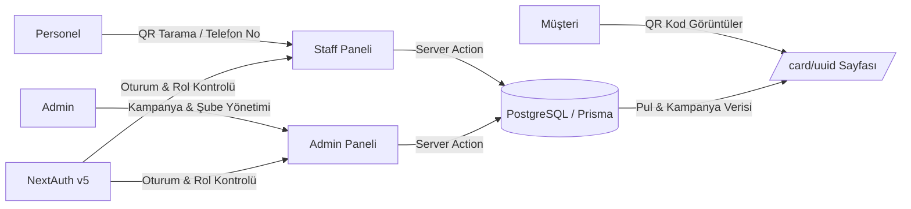

<div align="center">

# 💳 Doyalcard

### QR Kodlu Dijital Sadakat Kartı & Kampanya Yönetim Sistemi

Kağıt kartlara ihtiyaç duymadan, restoran ve işletmelerin müşteri sadakatini dijitalleştiren full-stack platform.

[](https://nextjs.org/)
[](https://www.typescriptlang.org/)
[](https://www.prisma.io/)
[](https://neon.tech/)
[](https://authjs.dev/)
[](https://tailwindcss.com/)
[](#-lisans)

[🌐 Canlı Demo](https://doyalcard.vercel.app) · [🐛 Hata Bildir](https://github.com/Selam47/doyalcard/issues) · [✨ Özellik Öner](https://github.com/Selam47/doyalcard/issues)

</div>

---

## 📖 İçindekiler

- [Proje Hakkında](#-proje-hakkında)
- [Öne Çıkan Özellikler](#-öne-çıkan-özellikler)
- [Ekran Görüntüleri](#-ekran-görüntüleri)
- [Teknoloji Yığını](#️-teknoloji-yığını)
- [Sistem Mimarisi](#-sistem-mimarisi)
- [Proje Dizin Yapısı](#-proje-dizin-yapısı)
- [Kurulum](#-kurulum)
- [Ortam Değişkenleri](#-ortam-değişkenleri)
- [Kullanılabilir Komutlar](#-kullanılabilir-komutlar)
- [Güvenlik Mimarisi](#️-güvenlik-mimarisi)
- [Yol Haritası](#️-yol-haritası)
- [Katkıda Bulunma](#-katkıda-bulunma)
- [Lisans](#-lisans)
- [İletişim](#-i̇letişim)

---

## 📌 Proje Hakkında

**Doyalcard**, restoran ve işletmeler için geliştirilmiş, kağıt kart kullanımını ortadan kaldıran **QR kod tabanlı dijital sadakat ve ödül yönetimi platformudur**.

Müşteriler her siparişlerinde dijital pul kazanır; belirlenen eşik değerlere (örn. 15 pul) ulaştıklarında sistem otomatik olarak hediyeleri tanımlar ve yeni döngüyü başlatır. İşletme tarafında ise yöneticiler kampanyaları, şubeleri ve personeli tek bir panelden yönetir.

> Bu proje **Ekrem Coşkun** için geliştirilmektedir.

---

## 🚀 Öne Çıkan Özellikler

| | Özellik | Açıklama |
|---|---|---|
| 📱 | **QR Kod Tabanlı Müşteri Kartı** | Her müşteriye özel, benzersiz (UUID) ve dinamik QR kod yapısı |
| ⚡ | **Hızlı Sipariş / Pul İşleme** | Personel panelinden kamerayla QR tarama veya telefon numarasıyla saniyeler içinde pul ekleme |
| 🎯 | **Dinamik Kampanya Motoru** | Admin panelinden tamamen özelleştirilebilir eşik değerleri (threshold) ve ödül kuralları |
| 🔒 | **Rol Bazlı Yetkilendirme** | NextAuth v5 ile Role-Based Access Control (RBAC) mimarisi |
| 📊 | **Yönetim Paneli (Dashboard)** | Şube, personel, müşteri ve aktif kampanya istatistiklerinin canlı takibi |
| 🛡️ | **KVKK Uyumlu Kayıt** | Müşteri kayıt süreçlerinde entegre onay mekanizması |
| 🔔 | **Anlık Bildirimler** | Sonner ile gerçek zamanlı toast bildirimleri |

---

## 🛠️ Teknoloji Yığını

| Katman | Teknoloji | Açıklama |
|---|---|---|
| **Framework** | Next.js 15 (App Router) | React Server Components & Server Actions |
| **Dil** | TypeScript | Uçtan uca type-safe geliştirme |
| **Veritabanı** | PostgreSQL (Neon.tech) | Serverless & cloud-native veritabanı |
| **ORM** | Prisma 7 | Schema yönetimi ve type-safe sorgular |
| **Kimlik Doğrulama** | NextAuth v5 (Auth.js) | Session bazlı, Bcrypt hash'li yetkilendirme |
| **Stil / UI** | Tailwind CSS v4 + shadcn/ui | Modern, responsive ve erişilebilir arayüz |
| **Bildirimler** | Sonner | Gerçek zamanlı toast bildirimleri |
| **QR Araçları** | `qrcode` & `html5-qrcode` | QR kod oluşturma ve kamera üzerinden tarama |
| **Medya/Depolama** | Firebase | Görsel ve statik varlık depolama |
| **Doğrulama** | Zod | Form ve API girdi doğrulama |

---

## 🏗️ Sistem Mimarisi



Akış özeti: müşteri kendi dijital kartını (`/card/[uuid]`) görüntüler → personel siparişte QR kodu tarar veya telefon numarasıyla müşteriyi bulur → sunucu tarafı eylem (server action) pul ekler → eşik değerine ulaşıldığında kampanya motoru otomatik olarak ödülü tanımlar.

---

## 📁 Proje Dizin Yapısı

```
doyalcard/
├── app/                  # Next.js App Router sayfaları ve Server Actions
│   ├── (auth)/           # Login ve yetkilendirme sayfaları
│   ├── admin/            # Yönetici paneli (kurallar, şubeler, personel)
│   ├── staff/            # Personel QR tarama ve müşteri arama paneli
│   └── card/[uuid]/      # Müşteriye özel dijital kart görünümü (public)
├── components/           # UI ve yeniden kullanılabilir React bileşenleri
├── lib/                  # Prisma client, auth konfigürasyonu ve yardımcı araçlar
├── prisma/               # Schema dosyası ve seed verileri
├── public/               # Statik görseller ve varlıklar
├── CLAUDE.md             # Proje geliştirme notları
└── package.json
```

---

## ⚙️ Kurulum

### Gereksinimler

- **Node.js** 20 veya üzeri
- **npm** (veya pnpm / yarn)
- **PostgreSQL** veritabanı (yerel ya da [Neon.tech](https://neon.tech) üzerinde serverless bir instance)

### Adım Adım Kurulum

**1. Depoyu klonlayın**

```bash
git clone https://github.com/Selam47/doyalcard.git
cd doyalcard
```

**2. Bağımlılıkları yükleyin**

```bash
npm install
```

**3. Ortam değişkenlerini tanımlayın**

Proje kök dizininde bir `.env` dosyası oluşturun ve [Ortam Değişkenleri](#-ortam-değişkenleri) bölümündeki değerleri doldurun.

```bash
cp .env.example .env   # .env.example yoksa manuel olarak oluşturun
```

**4. Veritabanı şemasını uygulayın**

```bash
npm run db:generate   # Prisma Client'ı oluşturur
npm run db:push       # Şemayı veritabanına yazar (geliştirme için hızlı yol)
# veya migration geçmişi tutmak isterseniz:
npm run db:migrate
```

**5. (Opsiyonel) Örnek verileri yükleyin**

```bash
npm run db:seed
```

**6. Geliştirme sunucusunu başlatın**

```bash
npm run dev
```

Uygulama varsayılan olarak [http://localhost:3000](http://localhost:3000) adresinde çalışmaya başlar.

**7. Production build almak için**

```bash
npm run build
npm run start
```

---

## 🔑 Ortam Değişkenleri

`.env` dosyanızda aşağıdaki değişkenlerin tanımlı olması gerekir:

```env
# Veritabanı (PostgreSQL / Neon.tech)
DATABASE_URL="postgresql://<kullanici>:<sifre>@<host>/<veritabani>?sslmode=require"

# NextAuth v5 (Auth.js)
AUTH_SECRET="guclu-ve-rastgele-bir-secret-key"
NEXTAUTH_URL="http://localhost:3000"

# Firebase (medya / statik varlık depolama)
NEXT_PUBLIC_FIREBASE_API_KEY="..."
NEXT_PUBLIC_FIREBASE_AUTH_DOMAIN="..."
NEXT_PUBLIC_FIREBASE_PROJECT_ID="..."
NEXT_PUBLIC_FIREBASE_STORAGE_BUCKET="..."
NEXT_PUBLIC_FIREBASE_MESSAGING_SENDER_ID="..."
NEXT_PUBLIC_FIREBASE_APP_ID="..."
```

> ⚠️ `AUTH_SECRET` değerini `openssl rand -base64 32` komutuyla güvenli şekilde üretebilirsiniz. `.env` dosyası asla versiyon kontrolüne dahil edilmemelidir (`.gitignore` içinde tanımlıdır).

---

## 📜 Kullanılabilir Komutlar

| Komut | Açıklama |
|---|---|
| `npm run dev` | Geliştirme sunucusunu başlatır |
| `npm run build` | Prisma Client'ı üretir ve production build alır |
| `npm run start` | Production build'i çalıştırır |
| `npm run lint` | ESLint ile kod kalitesi kontrolü yapar |
| `npm run db:generate` | Prisma Client'ı yeniden oluşturur |
| `npm run db:migrate` | Yeni migration oluşturup uygular |
| `npm run db:push` | Şemayı migration oluşturmadan veritabanına uygular |
| `npm run db:seed` | Veritabanına örnek/başlangıç verisi yükler |
| `npm run db:studio` | Prisma Studio'yu açar (veritabanını görsel olarak yönetme) |

---

## 🛡️ Güvenlik Mimarisi

- **Sıfır Sızıntı (Zero-Leakage):** Veritabanı kimlik bilgileri, JWT secret ve API anahtarları `.env` yapılandırması altında tutulur ve `.gitignore` kuralı ile versiyon kontrolü dışında bırakılır.
- **Güvenli Sunucu Eylemleri (Server Actions):** Tüm veri güncelleme ve pul ekleme fonksiyonları arka planda `auth()` oturum kontrolünden ve rol doğrulamasından geçer.
- **Middleware Koruması:** `/admin` ve `/staff` gibi kritik rotalar yetkisiz erişimlere karşı middleware katmanında engellenir.
- **Parola Güvenliği:** Personel ve yönetici şifreleri veritabanında **Bcrypt (Cost Factor: 12)** algoritmasıyla şifrelenerek saklanır.

---

## 🗺️ Yol Haritası

- [ ] Push notification desteği (kampanya hatırlatmaları)
- [ ] Çoklu dil desteği (EN / TR)
- [ ] Müşteri tarafı mobil PWA deneyimi
- [ ] Gelişmiş raporlama ve analitik dashboard
- [ ] SMS ile pul bildirimi entegrasyonu

---

## 🤝 Katkıda Bulunma

Katkılar memnuniyetle karşılanır! Katkıda bulunmak için:

1. Bu depoyu fork'layın
2. Yeni bir özellik dalı oluşturun (`git checkout -b ozellik/harika-ozellik`)
3. Değişikliklerinizi commit'leyin (`git commit -m 'feat: harika özellik eklendi'`)
4. Dalınızı push'layın (`git push origin ozellik/harika-ozellik`)
5. Bir Pull Request açın

---

## 📄 Lisans

Bu proje [MIT Lisansı](LICENSE) ile lisanslanmıştır.

---

## 📬 İletişim

**Proje Sahibi:** [@Selam47](https://github.com/Selam47)

**Canlı Demo:** [doyalcard.vercel.app](https://doyalcard.vercel.app)

Sorularınız veya önerileriniz için bir [issue](https://github.com/Selam47/doyalcard/issues) açabilirsiniz.

<div align="center">

⭐ Projeyi beğendiyseniz bir yıldız bırakmayı unutmayın!

</div>
